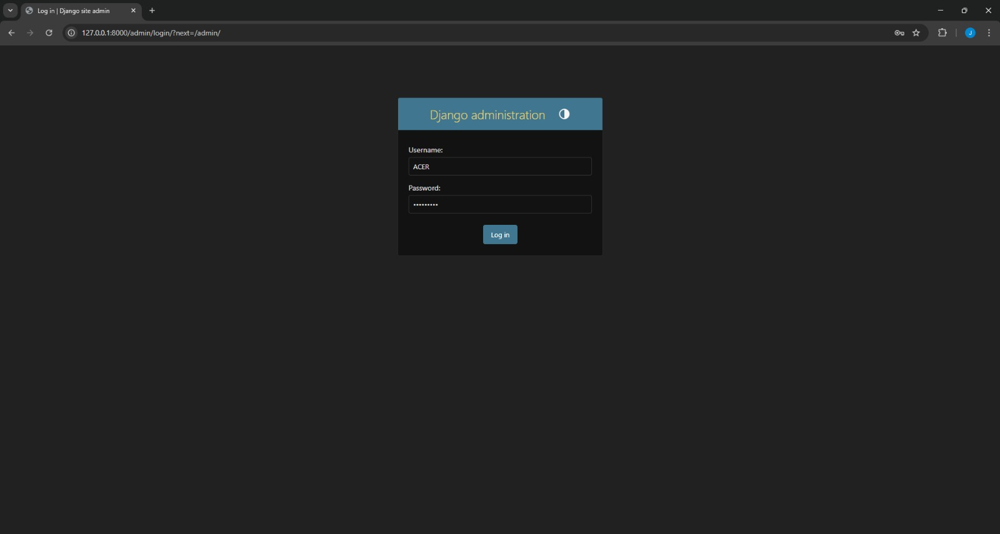
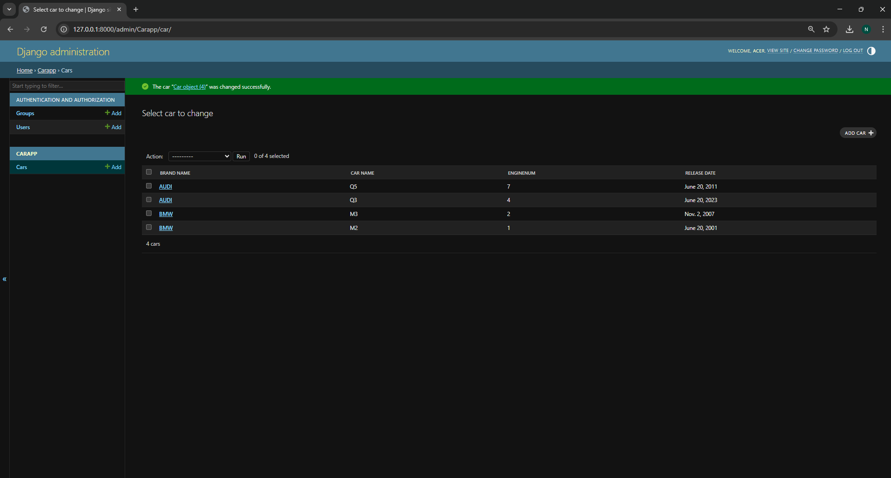

# Ex02 Django ORM Web Application
## Date: 4-12-2025

## AIM
To develop a Django application to store and retrieve data from a Car Inventory Database using Object Relational Mapping(ORM).

## DESIGN STEPS

### STEP 1:
Clone the problem from GitHub

### STEP 2:
Create a new app in Django project

### STEP 3:
Enter the code for admin.py and models.py

### STEP 4:
Execute Django admin and create details for 10 books

## PROGRAM
```
from django.db import models
from django.contrib import admin
class Car(models.Model):
    brand_name=models.CharField(max_length=20)
    car_name=models.CharField(max_length=10)
    enginenum=models.IntegerField()
    release_date=models.DateField()

class CarAdmin(admin.ModelAdmin):
    list_display=('brand_name', 'car_name', 'enginenum', 'release_date')

```
## OUTPUT



## RESULT
Thus the program for creating car inventory database database using ORM hass been executed successfully
